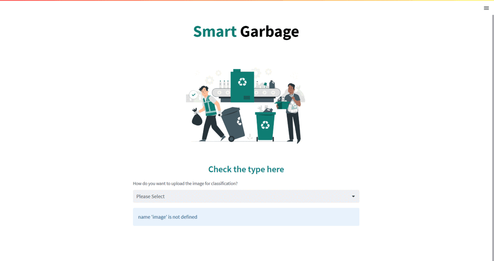
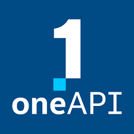
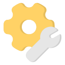

  [![Contributors][contributors-shield]][contributors-url]
  [![Forks][forks-shield]][forks-url]
  [![Stargazers][stars-shield]][stars-url]
  [![Issues][issues-shield]][issues-url]

<!-- PROJECT LOGO -->
 

  

  <h3 align="center">Smart Garbage Segregation</h3>

  

    Welcome to our project!
     
    <a href="https://github.com/raison024/Smart-Garbage-Segregation"><strong>Explore the docs »</strong></a>
     
     
    <a href="https://github.com/raison024/Smart-Garbage-Segregation">View Demo</a>
    ·
    <a href="https://github.com/raison024/Smart-Garbage-Segregation/issues">Report Bug</a>
    ·
    <a href="https://github.com/raison024/Smart-Garbage-Segregation/issues">Request Feature</a>
  

<!-- TABLE OF CONTENTS -->

  
Table of Contents

  <ol>
    <li>
      <a href="#about-the-project">About the Project</a>
      <ul>
        <li><a href="#inspiration">Inspiration</a></li>
        <li><a href="#intel-oneapi">Intel OneAPI</a></li>
        <li><a href="#built-with">Built With</a></li>
      </ul>
    </li>
    <li><a href="#what-it-does">What it does</a></li>
    <li><a href="#how-we-built-it">How we built it</a></li>
    <li><a href="#what-we-learned">What we learned</a></li>
  </ol>

<!-- ABOUT THE PROJECT -->
## About The Project
Smart Garbage Segregation is a project that aims to using AI/ML to efficiently and effectively sort waste into different categories such as plastic, glass, etc.

  

(<a href="#readme-top">back to top</a>)

## Inspiration 
As of 2021, the world generated over 2.01 billion tons of municipal solid waste annually. At least 33% of that waste was not managed in an environmentally safe manner. It is estimated that up to 8 million metric tons of plastic reach the planet’s oceans each year. That equates to five grocery bags filled with plastic for every foot of shoreline on earth. Garbage segregation is a critical issue in modern times due to the rising amount of waste generated by society. Traditional methods of garbage segregation involve manual sorting, which is time-consuming, labor-intensive, and often inefficient. AI/ML can provide a solution to this problem by automating the process of garbage segregation. In this project, we propose a system that utilizes AI/ML algorithms to identify and segregate different types of garbage. The system uses image recognition techniques to analyze the images captured by a camera, and then applies machine learning algorithms to classify the garbage into different categories. The system can also learn from its mistakes and improve its accuracy over time. By automating the process of garbage segregation, we can reduce the workload on human workers, increase efficiency, and reduce environmental pollution.

### Intel oneAPI 
Intel OneAPI is a comprehensive development platform for building high-performance, cross-architecture applications. It provides a unified programming model, tools, and libraries that allow developers to optimize their applications for Intel CPUs, GPUs, FPGAs, and other hardware. Intel OneAPI includes support for popular programming languages like C++, Python, and Fortran, as well as frameworks for deep learning, high-performance computing, and data analytics. With Intel OneAPI, developers can build applications that can run on a variety of hardware platforms, from edge devices to data centers, and take advantage of the performance benefits of Intel architectures.

### Built With 

This section should list any major frameworks/libraries used to bootstrap your project. Leave any add-ons/plugins for the acknowledgements section. Here are a few examples.

* [![oneapi][oneapi]][oneapi-url]
  * [![onednn][onednn]][onednn-url]
* [![python][python]][python-url]
* [![jupyter][jupyter]][jupyter-url]
* [![tensorflow][tensorflow]][tensorflow-url]
* [![streamlit][streamlit]][streamlit-url]

(<a href="#readme-top">back to top</a>)

<!-- What it does -->
## What it does 
The garbage segregation project using AI/ML automates the process of identifying and sorting different types of waste. The system uses image recognition techniques to analyze images captured by a camera and machine learning algorithms to classify the waste into different categories. By accurately identifying and segregating waste, the system can reduce the workload on human workers, increase efficiency, and reduce environmental pollution. The project also promotes responsible waste disposal practices by making people more aware of the types of waste they generate and the proper ways to dispose of them.

(<a href="#readme-top">back to top</a>)

## How we built it 
These are the steps involved in making this project: 
* Importing Libraries
* Data Importing
* Data Exploration
* Data Configuration
* Preparing the Data
  * Creating a Generator for Training Set
  * Creating a Generator for Testing Set
* Writing the labels into a text file 'Labels.txt
* Model Creation
* Model Compilation
* Training the Model (batch_size = 32, epochs = 10)
* Testing Predictions
* Saving model as 'model.h5'
* Deploying the Model as a Web Application using Streamlit

(<a href="#readme-top">back to top</a>)

## What we learned 
✅Building a Garbage Classification for Recycling project using OneDNN provided the opportunity to leverage highly optimized building blocks for implementing deep neural networks. OneDNN's library includes optimized algorithms for common neural network layers, such as convolution, pooling, and normalization, enabling fast and efficient execution of the model. In addition, OneDNN offers support for a variety of programming languages, including C++, Python, and Java. Leveraging OneDNN's optimization capabilities, it was possible to accelerate the training and inference of the deep learning models for garbage classification, and improve the overall throughput and scalability of the system.

✅ Waste management: I gained knowledge of waste management. It is the
process of collecting, treating, disposing, and recycling waste materials. It is
essential for maintaining a clean and healthy environment as well as preventing
the negative impacts of waste on human health and the environment.

✅Image Processing: Building a Garbage Classification for Recycling using
machine learning techniques involves processing large amounts of image data.
During the project, I have learned how to preprocess the images and extract
relevant features to improve the accuracy of your classification models.

✅Machine Learning: While building your Garbage Classification for Recycling
system, I gained a deeper understanding of the different types of machine
learning algorithms, including supervised, unsupervised, and reinforcement
learning. I have also learned how to use deep learning models such as
convolutional neural networks (CNNs) for image classification.

✅Model Evaluation: Evaluating the performance of your machine learning
models is a critical step in building an effective Garbage Classification for
Recycling system. I have learned how to use metrics such as accuracy,
precision, and recall to assess the performance of your models and identify
areas for improvement.

✅Data Analysis: In addition to collecting and analyzing data, I gained
experience in data cleaning, data wrangling, and data visualization. These skills
are essential for preparing data for machine learning models and communicating
insights to stakeholders.

✅Environmental Sustainability: By working on a project that promotes waste
reduction and recycling, you likely gained a deeper understanding of the importance of environmental sustainability. This knowledge has motivated me
to explore other ways to reduce waste and promote sustainable practices in your
community.

✅Collaboration: Building a project like this likely required collaboration with a
team of experts in various fields, such as waste management, machine learning,
and data analysis, and I learned the importance of working together to achieve
common goals.

Overall, the skills and knowledge I have gained while building Garbage
Classification for Recycling system are highly valuable and applicable to a wide
range of fields beyond waste management and recycling. Building Garbage
Classification for Recycling was a challenging and rewarding experience . 

(<a href="#readme-top">back to top</a>)

<!-- MARKDOWN LINKS & IMAGES -->
<!-- https://www.markdownguide.org/basic-syntax/#reference-style-links -->
[contributors-shield]: https://img.shields.io/github/contributors/raison024/Smart-Garbage-Segregation.svg?style=for-the-badge
[contributors-url]: https://github.com/raison024/Smart-Garbage-Segregation/graphs/contributors
[forks-shield]: https://img.shields.io/github/forks/raison024/Smart-Garbage-Segregation.svg?style=for-the-badge
[forks-url]: https://github.com/raison024/Smart-Garbage-Segregation/network/members
[stars-shield]: https://img.shields.io/github/stars/raison024/Smart-Garbage-Segregation.svg?style=for-the-badge
[stars-url]: https://github.com/raison024/Smart-Garbage-Segregation/stargazers
[issues-shield]: https://img.shields.io/github/issues/raison024/Smart-Garbage-Segregation.svg?style=for-the-badge
[issues-url]: https://github.com/raison024/Smart-Garbage-Segregation/issues

[product-screenshot]: images/screenshot.png

[python]: https://img.shields.io/badge/Python-3470a3?&logoColor=white
[python-url]: https://www.python.org/
[jupyter]: https://img.shields.io/badge/Jupyter%20Notebook-da5b0b?&logoColor=white
[jupyter-url]: https://jupyter.org/
[tensorflow]: https://img.shields.io/badge/TensorFlow-f0b93a?&logoColor=white
[tensorflow-url]: https://www.tensorflow.org/
[streamlit]: https://img.shields.io/badge/Streamlit-f24747?&logoColor=white
[streamlit-url]: https://streamlit.io/
[oneapi]: https://img.shields.io/badge/Intel%20oneAPI-20232A?&logoColor=61DAFB
[oneapi-url]: https://www.intel.com/content/www/us/en/docs/oneapi/programming-guide/2023-0/intel-oneapi-data-analytics-library-onedal.html
[onednn]: https://img.shields.io/badge/oneDNN-20232A?&logoColor=61DAFB
[onednn-url]: https://www.intel.com/content/www/us/en/developer/tools/oneapi/onednn.html

